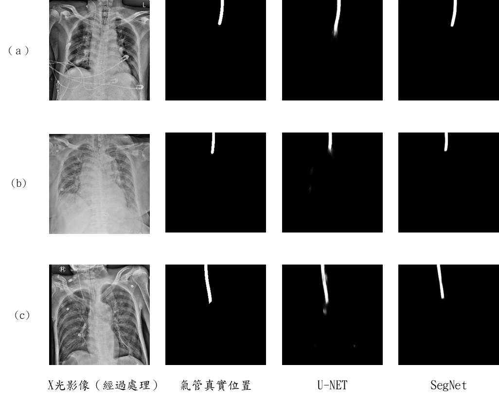

# 機器學習 專案作業一 (第十組)

依賴套件安裝:

```shell
pip install -r requirements.txt
```

## 檔案

* FCN.ipynb
* UNET.ipynb
* SegNet.ipynb
* DeepLab.ipynb


## 組員

* 資訊管理系-M11223045-王仁宏
* 資訊管理系-M11223010-葉哲丞
* 資訊管理系-M11223044-徐嘉佑
* 資訊管理系-M11223050-廖子皓

# 使用CNN模型實作圖像分割

本研究旨在探討深度學習演算法在氣管X光影像分割目標區域的應用，評估模型在ETT資料集中 分割氣管的準確性。本研究重點研究了FCN、U-Net、SegNet與DeepLab這些影像分割模型，並進行準確度比較，使用IoU等指標判斷結果，在U-Net與SegNet在分割結果取得良好的性能，確認X光影像分割應用之可行性。

